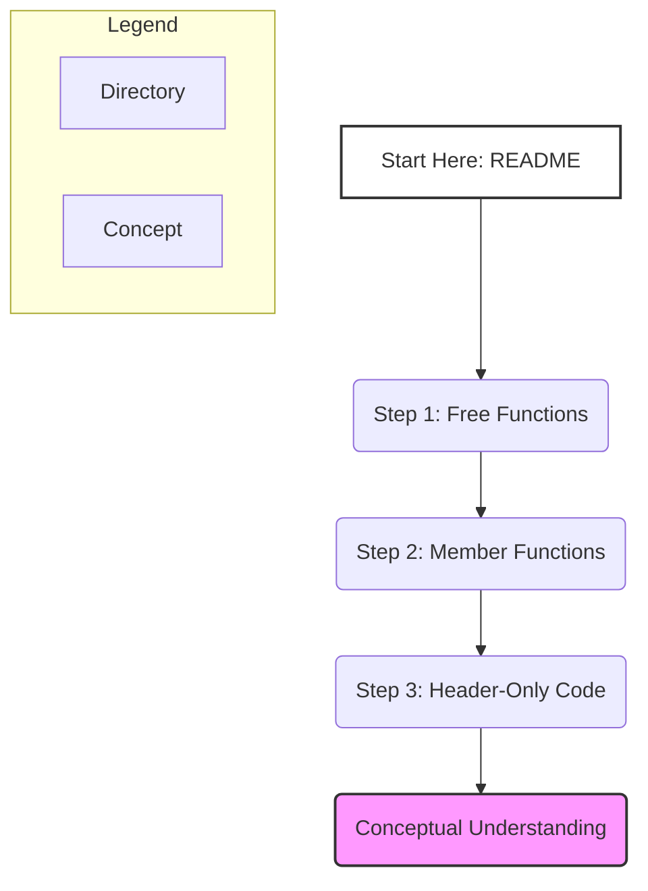

# C++ Code Organization Basics

This repository provides a minimal, compilable set of code examples that directly map to a foundational, multi-part guide series on C++ code organization. It serves as the practical companion to the documentation, demonstrating concepts from basic function separation to more advanced topics like templates.

## 📚 Documentation

All formal documentation, including the full project overview and learning roadmap, is maintained in Google Drive.

*   **[Main Drive Folder](https://drive.google.com/drive/folders/1YWd1JYflcqeWSnfqpHzpb8jP51jp-MAg)** - Contains all project documents.
*   **[Documentation Bundle](https://docs.google.com/document/d/1eHEqTIPnDIkR2Mg2eMDyhIUgVz7vLR-DoSgKTIzhA4w/edit?usp=drivesdk)** - The central document for this project.

## Architecture & Learning Path

The repository is structured as a series of progressive steps. Each directory is a self-contained example that builds on the concepts of the previous one. This staged approach is designed to prevent cognitive overload and build concepts progressively.



## Concepts Covered

1.  **`01-free-functions`**: The foundational pattern of C++ code organization:
    *   **Declaration** in a header file (`.h`).
    *   **Definition** in a source file (`.cpp`).
    *   Separate compilation and linking.

2.  **`02-member-functions`**: Extending the pattern to classes:
    *   Declaring a class and its member functions in a header.
    *   Defining those member functions in a source file.

3.  **`03-header-only`**: Special cases where definitions must go in headers:
    *   **Function Templates**: How the compiler needs the full definition to generate code.
    *   **`inline` Functions**: Hinting to the compiler to avoid function call overhead, which requires the definition to be visible at the call site.

## How to Run

All code is C++17 compliant. You will need `g++` (GCC) or `clang++` (Clang) to compile the examples. No build systems like CMake are used to keep the focus on the core concepts.

### 01-free-functions

This example demonstrates separate compilation and linking.

```bash
# 1. Compile each source file into an object file (-c flag)
g++ -c -std=c++17 01-free-functions/main.cpp -o main.o
g++ -c -std=c++17 01-free-functions/utilities.cpp -o utilities.o

# 2. Link the object files into a single executable
g++ main.o utilities.o -o free_functions_demo

# 3. Run the executable
./free_functions_demo

# 4. (Optional) Clean up object files
rm main.o utilities.o
```

### 02-member-functions

The process is identical, but with different files.

```bash
# 1. Compile
g++ -c -std=c++17 02-member-functions/main.cpp -o main.o
g++ -c -std=c++17 02-member-functions/Counter.cpp -o Counter.o

# 2. Link
g++ main.o Counter.o -o member_functions_demo

# 3. Run
./member_functions_demo

# 4. (Optional) Clean up
rm main.o Counter.o
```

### 03-header-only

Since all definitions are in header files, the process is simpler. There are no `.cpp` files to compile separately (besides `main.cpp`).

```bash
# 1. Compile and link in one step
g++ -std=c++17 03-header-only/main.cpp -o header_only_demo

# 2. Run
./header_only_demo
```

## References

*   [ISO C++ Standard](https://isocpp.org/)
*   [cppreference.com - A great C++ language reference](https://en.cppreference.com/w/)
*   [One Definition Rule (ODR)](https://en.cppreference.com/w/cpp/language/definition)
