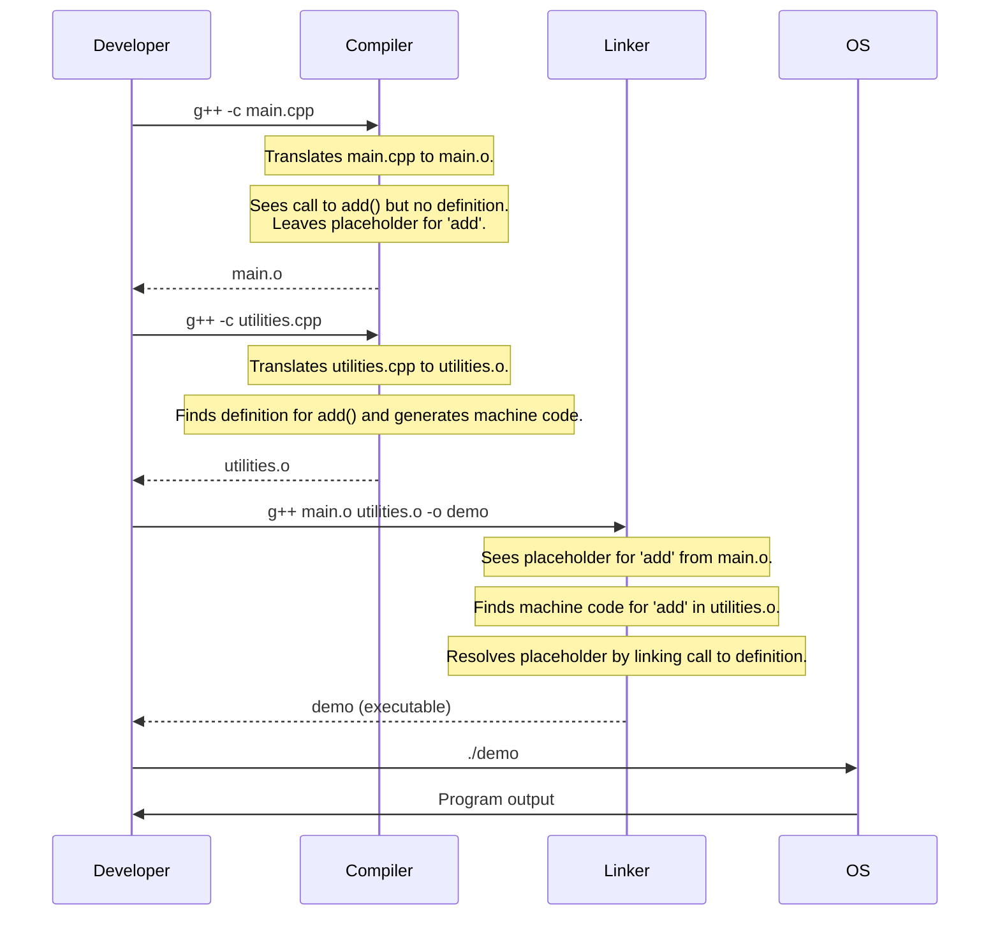

# Architecture: The C++ Build Model

This document explains the conceptual model behind C++'s separation of code into header (`.h`, `.hpp`) and source (`.cpp`, `.cxx`) files. Understanding this model is key to diagnosing common errors like "unresolved external symbol" and appreciating why the code is organized the way it is.

## The Compiler and the Linker

The process of turning C++ source code into an executable program involves two main stages: **compilation** and **linking**. We use a single command like `g++ main.cpp -o prog`, but the toolchain performs these two distinct steps internally.

1.  **Compiler**: The compiler translates a single source file (`.cpp`) into an **object file** (`.o` or `.obj`). This object file contains machine code, but it's not yet a complete program. If the source file contains a *call* to a function defined elsewhere (e.g., in another `.cpp` file), the compiler doesn't know where that function's code is. It leaves a placeholder, essentially saying, "The linker will figure this out."

2.  **Linker**: The linker takes all the object files generated by the compiler and "links" them together. It resolves all the placeholders left by the compiler. If it finds a placeholder for a function `add()`, it looks through all the other object files for the actual machine code for `add()`. Once all placeholders are filled, it combines everything into a single, runnable executable file.

### The One Definition Rule (ODR)

The ODR is a cornerstone rule in C++:

*   A variable or non-inline function can only have **one definition** in the entire program.
*   If you define the same function in `utilities.cpp` and `main.cpp`, the linker will see two different machine-code versions of it and won't know which one to use, resulting in a "multiple definition" error.

This is why we **declare** in headers and **define** in source files.

*   The `#include` directive effectively copy-pastes the header file content. Multiple source files can include the same header, getting the same *declaration* (the promise). This is fine.
*   Only one source file provides the *definition* (the fulfillment of the promise). The linker can then find this single, authoritative version.

## Sequence of Events: Compilation & Linking

This diagram shows the flow for the `01-free-functions` example.

This explicit separation makes the build process tangible and helps clarify why header guards and the One Definition Rule are so critical for writing scalable C++ applications.